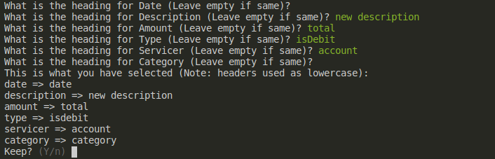
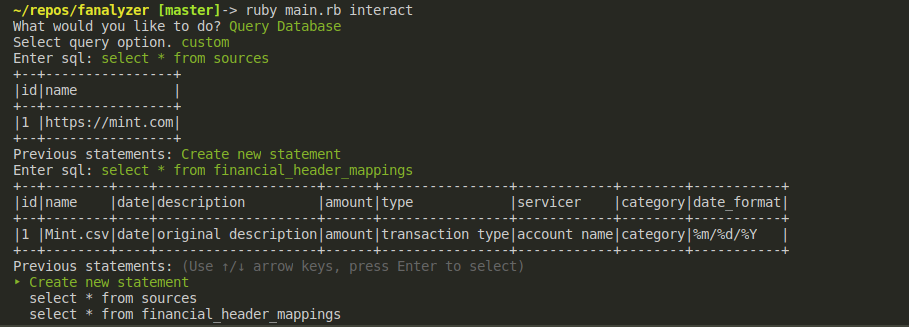
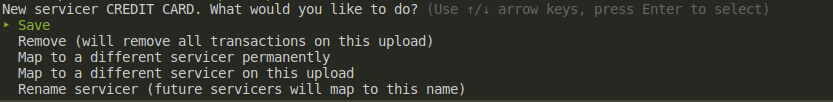
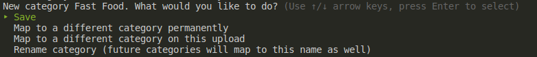
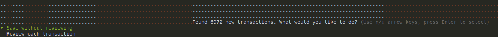

# Fanalyzer

> A command line tool to analyze your financial data using sql.

Upload your financial data into an sqlite database using an interactive command line tool. Get straight to analyzing your data however you see fit and stop messing around with clunky uis, unhelpful budgeting apps, and annoying pagination limitations. Focus on analysis and less on maintenance of your data.

## Installation
- Built using ruby (version > 2.5).
- Install the bundler gem
```
gem install bundler
```
- Clone this repo
```
git clone git@github.com:derigible/fanalyzer.git
```
- Install bundler dependencies
```
bundle install
```
- Setup a new database
```
ruby main.rb create_db -m
```
- Test installation
```
$ ruby main.rb interact
What would you like to do? (Use ↑/↓ arrow or number (1-2) keys, press Enter to select)
‣ 1. Query Database
  2. Upload CSV to Database
```

## Features
Fanalyzer is built with the intention of getting out of the way of analysis, aiding the user to upload their data as efficiently as possible and providing tools to speed up future use.

### Upload from CSV File
Most financial data exports use csv files, often with similar data but different headers for that data. Fanalyzer allows a user to take a csv dump from any source and map the data to a standard input.



Save the mapping and the next time you want to upload that csv it will automatically map the data to the database fields, speeding time to analysis.

### Query Data Using Builtin Sql Connection
No need to manage database strings and connections - all database management is handled by the system and outputs queries to the terminal. Previous unique queries are also listed so that you can easily rerun them within the same session.



There is nothing holding you back from creating any sql-compliant query and generating whatever report you can dream of for your financial data.

### Use Local or Remote Databases
Currently sqlite3 and postgresql database are supported, which means that your database does not have to be limited to your local machine. Simply edit the `db/config.yml` file to point to a remote database. Built on top of the [Sequel gem](http://sequel.jeremyevans.net/rdoc/files/doc/security_rdoc.html#label-Database+Connection+Options), database connection is handled through the application.

## Usage
Fanalyzer is simple to use. Each step of the process is handled through command line prompts that attempt to give you the data you need as quick as possible.

To begin:
```
ruby main.rb interact
```
This will bring up some options to do with the system, such as query your data or upload new data.

### Querying Data
Choose option #1 in the command prompt. This will ask you to enter an sql statement.

There is no limit to the kinds of sql you can enter, so if you are familiar with sql you should be able to create any type of query that you want with an output of the data in a table to the terminal.

If you are not familiar with sql, [here is a primer](https://www.w3schools.com/sql/).

Your quering should look like the following:


### Uploading Data
Choose option #2 in the command prompt. This will lead you to a series of questions.

#### Source
A source is the source of the file you will be uploading, such as your bank statement download, from mint.com, or any other source that provides a csv. This will be used to track where data was loaded from and at what time (via an associated upload record in the database).

After entering the name of the source, press enter.

#### Heading Mapper
A key feature of Fanalyser uploading is being able to normalize your data columns via header mappings. Create a new header mapping or use a previously saved mapping on upload.

After selecting the header mapping, press enter. If you do not see the mapping you want, enter `n` (if only one mapping is created), or select `None` to create a new mapping. If not mappings are present you will be prompted to make a new mapping.

#### Data Format
Csv data does not have a standard date format, and so a string parsing must be done. Fanalyzer uses the date directives found in the ruby [`strftime` function](https://ruby-doc.org/stdlib-2.4.1/libdoc/date/rdoc/Date.html#method-i-strftime).

A few common formats are given to choose from. Currently only the three methods are supported, but future versions will allow the user to put a custom date parse template to be used. This decision will be saved for future parsing of data for this profile.

After selecting the format, press enter.

#### CSV Path
Enter the full path to the csv file to be uploaded. This file will be stored for future use, so if you download the csv to the same location each time you will be able to make use of this path.

Select the path you want and press enter, or select `None` to enter a new path.

#### CSV Extraction
After all the options have been selected Fanalyzer will scan through each transaction and do field mapping and data normalization. If new categories or servicers are found you will be prompted to take action.

##### New Servicer Dialog
The new servicer dialog is used to allow mapping obscure servicer names (such as Credit Card) to a more descriptive servicer name (ie American Express). Several options are provided to create this servicer mapping.



###### Save
Save will save the servicer to the database as is and will not ask again in the future.

###### Remove
Remove all transactions associated with this servicer in this upload. Only applicable to the current upload. Transactions from servicer already in the database will remain unchanged.

###### Map to a Different Servicer Pemanently
This and all future uploads will treat this servicer as one that has already been saved to the database. Any transaction with this servicer attached will be remapped to the new servicer.

###### Map to a Different Servicer on this Upload
For this upload only map each transaction to a servicer that already has been saved in the database. Future uploads will not recognize this mapping and you will be prompted again for what to do with this servicer and all transactions associated with it.

###### Rename Servicer
Map servicer name to a different name. All future uploads will also map to this new servicer name.

##### New Category Catalog
After all servicers have been handled, you will be greeted with a new dialog similar to servicers, but for categories. Currently it is assumed that each upload has a category associated with each transaction. Future versions will allow you to skip this step.



###### Save
Save will save the category to the database as is and will not ask again in the future.

###### Map to a Different Category Pemanently
This and all future uploads will treat this category as one that has already been saved to the database. Any transaction with this category attached will be remapped to the new category.

###### Map to a Different Category on this Upload
For this upload only map each transaction to a category that already has been saved in the database. Future uploads will not recognize this mapping and you will be prompted again for what to do with this category and all transactions associated with it.

###### Rename Category
Map category name to a different name. All future uploads will also map to this new category name.

##### New Transactions Found Dialog
After all categories have been handled, Fanalyzer will scan through each transaction and will check to see if any new transactions have been found (by checking the date, amount, and transaction type combination are already in the database). If so, you will be prompted to either 1) Save without Reviewing, or 2) Review each transaction



###### Save without Reviewing
This will save all found transactions into the database without any review.

###### Review each transaction
This option will prompt you to review each transaction. The idea behind this is that there may be some actions that you wish to take on a particular transaction (such as split into two transactions).

** Note - this feature is not currently done, but is on the road map. There are lots of features intended for this branch of uploading, such as transaction splitting, transaction editing before save, adding tags, and transaction combining.

*** Note 2 - at some point a transaction will be rolled into a construct called an event, where an event contains all the transactions relevant to a financial event (such as purchasing something using a checking account, which in turn will cause an overdraft pull from a savings account to cover the purchase event - all transactions that are recorded separately but are related to the same event).

## Roadmap and Todos
There are lots of things that I would like to do with Fanalyzer. Below is a list of a few features on the roadmap:

FEATURES
- [ ] Add Servicer Manually
- [ ] Add Category Manually
- [ ] Add Transaction Manually
- [ ] Edit Transaction Metadata
- [ ] Add Event Rollup Functionality
- [ ] Add New Transaction Review
- [ ] Allow for csv upload without categories
- [ ] Allow for csv upload without servicers
- [ ] Allow for other type of data format upload (json, yaml)?
- [ ] Persisting sql queries to database
- [ ] Persist query results to file
- [ ] Persist query results to database
- [ ] Create reporting (not sure what this will look like, but will be canned reports that can be viewed as an option from the main dialog)
- [ ] Support Custom Date formats

## Contributing
> Contributions to this project are encouraged and welcome.

If you find this to be an interesting project, feel free to make a pull request. I will be pretty liberal with what I accept, though do expect some coaching about the architecture if it is drastically different than how it is laid out now.
